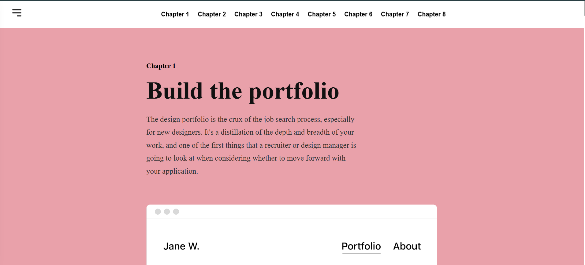

# 📘 Design Interview Guide

A pixel-perfect and fully responsive Design Interview Guide built using React, TypeScript and Custom CSS.

The project recreates a professional multi-chapter landing page inspired by a Figma design.

------------------------------------------------------------------

## 🚀 Live Demo

https://design-interview-guide-hs3g.vercel.app/

--------------------------------------------------------------------

## 📸 Preview Home Page


--------------------------------------------------------------------

## ✨ Features

- Pixel-Perfect UI Implementation
- Fully Responsive Design (Desktop, Tablet & Mobile)
- Built with React 18 + TypeScript
- Functional Components & React Hooks
- Reusable Component Architecture
- Custom CSS Styling
- Smooth Scroll Navigation
- Fixed Navigation Bar
- Auto Hide Navbar on Scroll Down
- Auto Show Navbar on Scroll Up
- Responsive Hamburger Menu
- Chapter Navigation with Smooth Scrolling
- Scroll-To-Top Floating Button
- Responsive Typography
- Clean Folder Structure
- Type-safe Component Props
- Optimized Image Rendering
- Cross Browser Compatible

-------------------------------------------------------------------

## 📝 Assumptions

- Images are used as provided design assets.
- All chapters are implemented as reusable React components.
- Smooth scrolling is enabled for better navigation.
- The layout is optimized for modern browsers.
- Focus was placed on reusable architecture and responsiveness.

--------------------------------------------------------------------
## ⚡ Performance

- Optimized React Component Rendering
- Reusable Components
- Lightweight CSS
- Minimal Re-renders
- Type-safe Development
- Responsive Images

-------------------------------------------------------------------------
## 📱 Responsive Support

- Desktop
- Laptop
- Tablet
- Mobile
--------------------------------------------------------------------------
## 🛠 Tech Stack

- React
- TypeScript
- Vite
- CSS3
- React Icons

---------------------------------------------------------------------------

## 📂 Folder Structure

```text
design-interview-guide/
│
├── public/
│
├── src/
│   │
│   ├── images/
│   │   ├── chapter1.png
│   │   ├── chapter2.png
│   │   ├── chapter3.png
│   │   ├── chapter4.png
│   │   ├── chapter5.png
│   │   ├── chapter6.png
│   │   ├── chapter7.png
│   │   └── chapter8.png
│   │
│   ├── components/
│   │   │
│   │   ├── Navbar/
│   │   │   ├── Navbar.tsx
│   │   │   └── Navbar.css
│   │   │
│   │   ├── ChapterCard/
│   │   │   ├── ChapterCard.tsx
│   │   │   └── ChapterCard.css
│   │   │
│   │   ├── ScrollTopButton/
│   │   │   ├── ScrollTopButton.tsx
│   │   │   └── ScrollTopButton.css
│   │   │
│   │   └── Cursor/
│   │       ├── Cursor.tsx
│   │       └── Cursor.css
│   │
│   ├── data/
│   │   └── chapters.ts
│   │
│   ├── App.tsx
│   ├── App.css
│   ├── index.css
│   └── main.tsx
│
├── .gitignore
├── index.html
├── package.json
├── package-lock.json
├── README.md
├── tsconfig.json
├── tsconfig.app.json
├── tsconfig.node.json
└── vite.config.ts
```

-------------------------------------------------------------------

## 📖 Chapters

- Chapter 1 – Build the Portfolio
- Chapter 2 – Writing Case Studies
- Chapter 3 – Portfolio Presentations
- Chapter 4 – Resumes & Cover Letters
- Chapter 5 – Find & Apply to Jobs
- Chapter 6 – Preparing for Behavioral Interviews
- Chapter 7 – Design Challenges
- Chapter 8 – The Offer Stage

-------------------------------------------------------------------

## ⚙️ Installation

Clone the project

```bash
git clone https://github.com/Sandeepaba/design-interview-guide.git
```
Go inside the folder

```bash
cd design-interview-guide
```

Install packages

```bash
npm install
```

Run project

```bash
npm run dev
```

Build Project

```bash
npm run build
```

------------------------------------------------------

## 🎯 What I Learned

- Building reusable React components
- Type-safe development with TypeScript
- Responsive UI Design
- CSS Layout Techniques
- Smooth Scroll Navigation
- Component Composition
- Folder Structure Best Practices

------------------------------------------------------

## 👨‍💻 Author

### Sandeep Yadav

Frontend Developer

GitHub:
https://github.com/Sandeepaba

LinkedIn:
https://www.linkedin.com/in/sandeep-yadav-6729a8254/
----------------------------------------------------------   ***** --------------------------------------------------------------